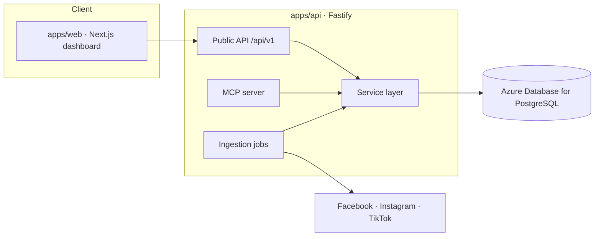

# BizSocial360

A **Business Social Media Dashboard** that turns engagement data from **Facebook,
Instagram, and TikTok** into actionable insight: how posts and stories perform,
which customer comments are still waiting for a reply, and the best times to
publish.

> Status: **Phase 1 scaffold.** Facebook & Instagram are the first active
> integrations; TikTok is modelled and feature-flagged pending API approval.
> Routes currently return realistic sample data so the full stack runs end-to-end
> before live provider ingestion lands.

## What it does

- 📊 **Engagement insights** — impressions, reach, interactions, and engagement
  rate across posts, stories, reels, and videos.
- 💬 **Response queue** — surfaces customer comments awaiting a reply, with
  waiting-time tracking so nothing slips past your SLA.
- ⏰ **Publish-time guidance** — recommended posting windows from historical
  engagement.
- 🤖 **AI-ready** — an MCP server exposes insights as tools so AI agents can
  query metrics, pending comments, and recommendations.

## Architecture

A **modular monolith** in an **npm-workspaces monorepo** (see
[ADR-0002](docs/adr/0002-modular-monolith-and-monorepo.md)).



Key decisions are recorded as [Architecture Decision Records](docs/adr/).

## Repository structure

```
bizsocial360/
├── apps/
│   ├── api/              # Fastify backend: REST public API, MCP server, Prisma
│   │   ├── prisma/       # Database schema (Azure PostgreSQL)
│   │   └── src/
│   │       ├── public-api/   # Versioned external REST API (/api/v1)
│   │       ├── mcp/          # Model Context Protocol server
│   │       ├── routes/       # Health/readiness + route registration
│   │       ├── services/     # Business logic (sample data today)
│   │       └── config/       # Validated environment config
│   └── web/              # Next.js dashboard (App Router + Tailwind)
├── packages/
│   └── shared/           # Shared types & DTO contracts
├── infra/                # docker-compose (local) + Azure Bicep (cloud)
└── docs/adr/             # Architecture Decision Records
```

## Tech stack

| Layer        | Choice                                                        |
| ------------ | ------------------------------------------------------------- |
| Client       | Next.js 14 (App Router), React, TailwindCSS                   |
| Backend      | Node.js, Fastify, TypeScript                                  |
| Database     | Azure Database for PostgreSQL + Prisma ORM ([ADR-0003](docs/adr/0003-azure-database-for-postgresql.md)) |
| Public API   | REST + OpenAPI (Swagger UI at `/docs`)                        |
| AI surface   | Model Context Protocol (MCP) server                           |
| Auth         | App auth + provider OAuth, kept separate ([ADR-0004](docs/adr/0004-authentication-model.md)) |
| Cloud        | Azure App Service + Bicep IaC                                 |
| CI           | GitHub Actions (private repo)                                 |

## Prerequisites

- Node.js ≥ 20 (22 recommended — see `.nvmrc`)
- npm ≥ 10
- Docker (for local PostgreSQL) **or** an Azure PostgreSQL connection string

## Getting started

```bash
# 1. Install all workspace dependencies
npm install

# 2. Start a local database
docker compose -f infra/docker-compose.yml up -d

# 3. Configure environment
cp apps/api/.env.example apps/api/.env
cp apps/web/.env.example apps/web/.env

# 4. Generate the Prisma client and apply the schema
npm run db:generate
npm run db:migrate

# 5. Run the apps (in separate terminals)
npm run dev:api    # http://localhost:4000  (docs at /docs)
npm run dev:web    # http://localhost:3000
```

The dashboard renders sample data even if the API is not running, so you can
open the web app immediately; start the API for "live" data.

## Scripts

| Command                 | Description                                       |
| ----------------------- | ------------------------------------------------- |
| `npm run dev:api`       | Run the backend in watch mode                     |
| `npm run dev:web`       | Run the Next.js dashboard                          |
| `npm run build`         | Build all workspaces                              |
| `npm run lint`          | Lint the whole repo (ESLint flat config)          |
| `npm run typecheck`     | Type-check all workspaces                         |
| `npm run format`        | Format with Prettier                              |
| `npm run db:generate`   | Generate the Prisma client                        |
| `npm run db:migrate`    | Create/apply a dev migration                      |
| `npm run db:local`      | Run a local PostgreSQL (embedded, no Docker)      |
| `npm run db:seed`       | Seed demo data into the database                  |
| `npm run db:studio`     | Open Prisma Studio                                |
| `npm run test`          | Run unit + integration tests                      |
| `npm run test:unit`     | API unit tests                                    |
| `npm run test:integration` | API integration tests (Fastify inject)         |
| `npm run test:e2e`      | Web end-to-end tests (Playwright)                 |
| `npm run mcp:dev`       | Run the MCP server over stdio                     |

## Public API

When the API is running, explore the OpenAPI docs at
<http://localhost:4000/docs>. v1 endpoints include:

- `GET /api/v1/accounts`
- `GET /api/v1/insights/summary`
- `GET /api/v1/insights/content`
- `GET /api/v1/insights/recommendations`
- `GET /api/v1/insights/publish-windows`
- `GET /api/v1/comments`

## Deployment

See [`infra/README.md`](infra/README.md) for local Docker and Azure Bicep
deployment instructions.

## Testing

Three layers, all runnable from the repo root:

- **Unit** (`npm run test:unit`) — pure logic: token encryption, OAuth state
  signing, engagement aggregation, provider adapter wiring. Node's built-in test
  runner via `tsx`.
- **Integration** (`npm run test:integration`) — the Fastify app exercised
  in-process with `app.inject()`. Public endpoints are asserted in a
  database-agnostic way; the auth + connections + sync suite runs when a
  `DATABASE_URL` is available (otherwise it is skipped).
- **End-to-end** (`npm run test:e2e`) — Playwright drives the dashboard and
  login pages. Locally it boots the Next.js dev server automatically; set
  `E2E_BASE_URL` to run against a deployed environment instead.

## CI/CD

**Continuous integration — GitHub Actions** (runs on the GitHub repo):

- [`ci.yml`](.github/workflows/ci.yml) — on every push/PR to `main`/`develop`:
  lint, typecheck, build, and unit + integration tests against a Postgres
  service container.

**Staging deployment — Azure DevOps Pipelines** (owns deploys to Azure):

- [`azure-pipelines.yml`](azure-pipelines.yml) — on push to `develop`:
  **verify** (lint/typecheck/test/build against a Dockerized Postgres) →
  **deploy** the API and web to the Azure **staging** App Services (with a
  staging-database migration) → **e2e** runs the Playwright suite against the
  live staging URL and publishes the report.

  The deploy and e2e stages are gated behind a `deployToStaging` parameter
  (default **false**), so the pipeline runs green (Verify only) until Azure is
  configured. Enable deployment by running the pipeline with the parameter set
  to true (or flip its default) once the steps below are done.

One-time Azure DevOps setup:

1. **Service connection** — Project Settings → Service connections → create an
   **Azure Resource Manager** connection to your subscription.
2. **Variable group** — Pipelines → Library → create `bizsocial360-staging`:

   | Variable                | Secret | Purpose                                    |
   | ----------------------- | :----: | ------------------------------------------ |
   | `azureServiceConnection`|        | Name of the ARM service connection         |
   | `apiAppName`            |        | App Service name for the API (Bicep output)|
   | `webAppName`            |        | App Service name for the web app           |
   | `stagingApiUrl`         |        | Staging API URL (baked into the web build) |
   | `stagingWebUrl`         |        | Staging web URL (e2e target)               |
   | `STAGING_DATABASE_URL`  |   ✓    | Staging PostgreSQL connection string       |

3. **Pipeline** — Pipelines → New pipeline → select this repo and
   `azure-pipelines.yml`.
4. **Environment** — Pipelines → Environments → create `staging` (add approval
   checks here if desired).

App Services are provisioned by [`infra/azure/main.bicep`](infra/azure/main.bicep) —
deploy that first. The GitHub [`deploy-staging.yml`](.github/workflows/deploy-staging.yml)
workflow remains as a **manual-only fallback** (so it never double-deploys
alongside Azure DevOps).

## Roadmap

1. **Phase 1 — Bootstrap** ✅ monorepo, client, API, DB schema, MCP, ADRs, CI.
2. **Phase 2 — Core platform** ✅ auth, organizations, account linking.
3. **Phase 3 — Provider ingestion** ✅ Facebook & Instagram via Graph API; TikTok adapter.
4. **Phase 4 — Insights** analytics, response queue, publish-time engine, AI summaries.
5. **Phase 5 — Public API & MCP** hardened external contracts.
6. **Phase 6 — Cloud** Azure deploy, CI/CD gates, observability.
7. **Phase 7 — Hardening** security, tests, docs.

## License

Private — all rights reserved.
